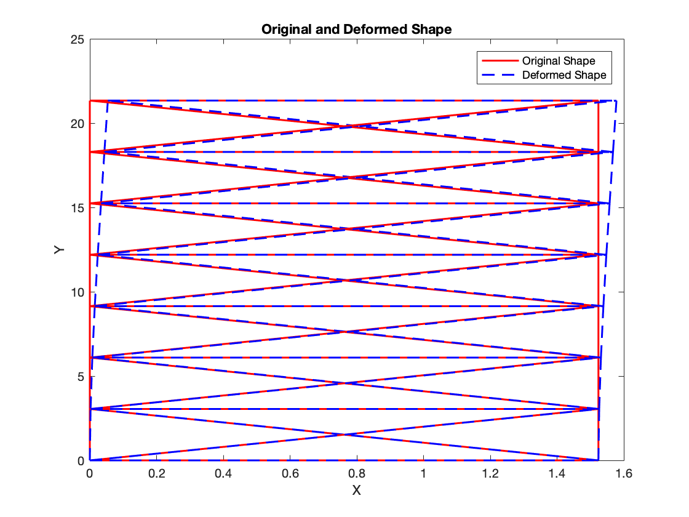
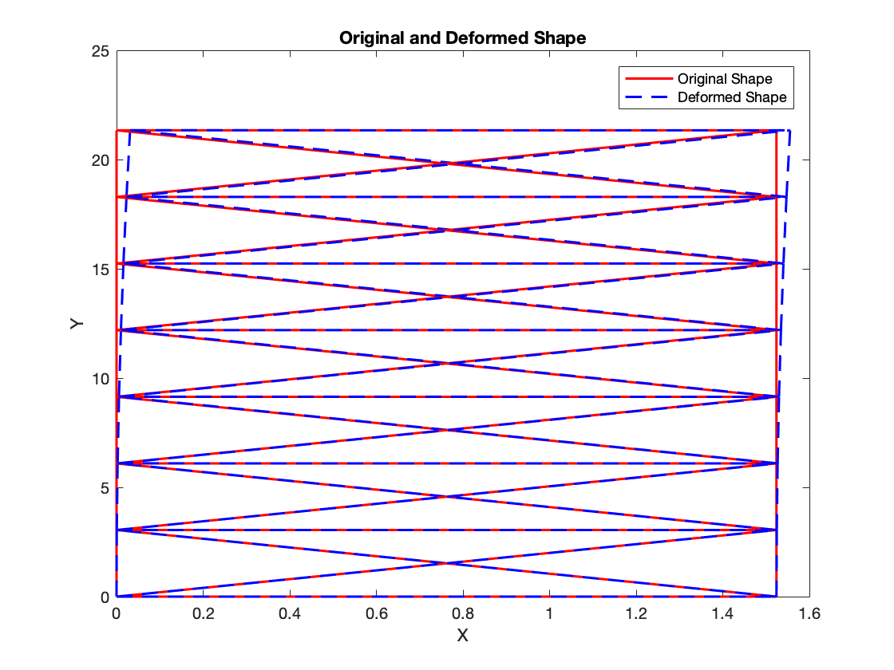

# FEM Code for 2D Bars
This repo contains the final project of EMA 605 which is a 2D finite element analysis code. The the detail instruction is in [instruction.pdf](docs/instruction.pdf).

1. Deformation under wind load

2. Deformation under thermal load

